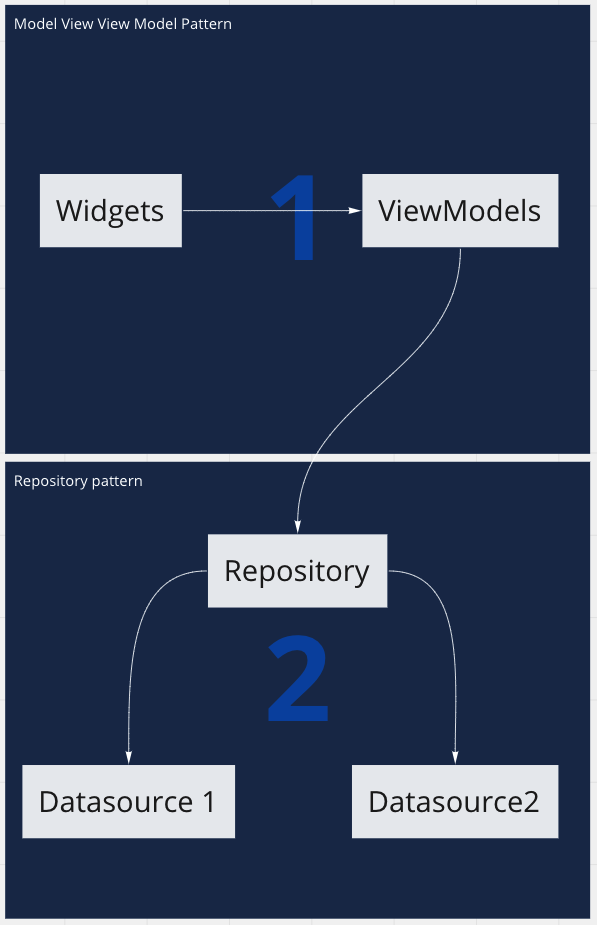

# flutter_architecture_template

In this project you could see an example with clean architecture using flutter. Please, take in account, this is not the
Bible, is just my approach, my vision of how it should be. I'm opening to discuss with everyone about this :)

## The architecture

In this architecture we have 3 main folders

- Domain: Which includes everything regarding the domain logic of the app, it must also contain the domain models
- Data: In this folder, we will include every class that should manage (or be managed) by the repository pattern
- View: Widgets and ViewModels, that's all, so the presentation logic must be here

## Software patterns

- MVVM (Model View View Model)
- Repository

## Libraries used

- stacked
- http
- sqflite
- get_it

## Dependency injection

Ok... well, there is no dependency injection, we have a Service Locator, which is provided by get_it

## Navigation

WIP

## Disclaimer

I use this architecture because I think it is the best for developing robust applications,
I encourage you to launch a pull request but with using `Provider`, `Bloc`, `GetX` or whatever, it will be helpful!! :)

